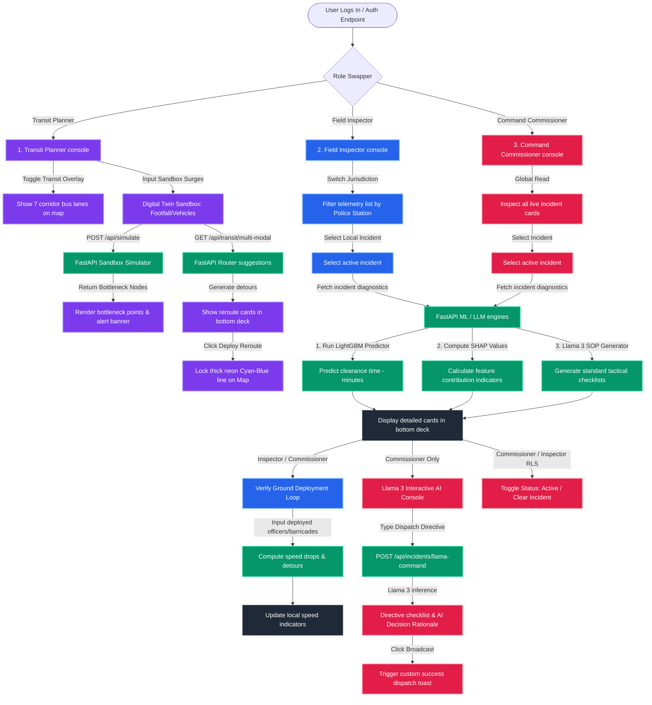

# RESILIO: System Architecture & Workflows Flowchart

This flowchart outlines how the **RESILIO** municipal traffic command center operates. It diagrams the path from user login, role assignment, and localized data filtering, to real-time simulation repaints, machine learning ETA predictions, and interactive Llama 3 command dispatches.

---

## 🗺️ System-Wide Flowchart

---

## 📝 Flow Explanation

### 1. Authentication & Role Switcher
* The platform starts at the login page. Based on the selected profile, users are allocated separate security contexts:
  * **Transit Planner**: Macro transit routing.
  * **Command Commissioner**: Global administrative oversight.
  * **Field Inspector**: Localized jurisdiction response.

### 2. Transit Planner pipeline (Macro Flow)
* **Goal**: Optimize bus lanes and traffic flow corridors.
* **Input**: Surges (vehicles and footfall) are entered into the sandbox.
* **Processing**: FastAPI simulates bottlenecks and computes suggestions.
* **Output**: The map displays bottleneck points and suggestions card deck appears. Clicking **Deploy** locks in a cyan priority route on the GIS map.

### 3. Incident Diagnostics pipeline (Micro Flow)
* **Goal**: Predict incident clearance time and outline tactical SOPs.
* **Process**: Selecting an active incident pulls logs.
  * **LightGBM Model**: Predicts the clearance time in minutes.
  * **SHAP Model**: Explains variable weight impacts (e.g. why the ETA is high or low).
  * **Llama 3 Engine**: Generates context-based Standard Operating Procedures (SOPs).

### 4. Interactive Command Console & RLS (Action Flow)
* **Command Commissioner**: Accesses the Llama 3 AI command console to request customized dispatches. The backend returns both the dispatch checklist and the **AI Decision Rationale** ("Why this is taken").
* **Field Inspector**: Limited to their police station jurisdiction (Row-Level Security). They submit feedback (deployed units) to calculate localized speed drops.
