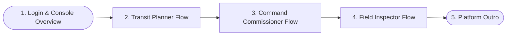

# RESILIO: Video Presentation & Demo Script Guide
This guide outlines the step-by-step storyline, active roles, and feature overrides for recording a high-fidelity video walkthrough of the **RESILIO** municipal traffic command console.

---

## 📹 Video Presentation Storyline

### Chapter 1: The Unified Control Room (Introduction)
* **Visual Action**: Show the login screen. Log in using username `planner1` and password `password`. Let the viewport render the full desaturated dark-matter map.
* **Speaking Script**:
  > *"Welcome to RESILIO, an enterprise-tier municipal traffic command center designed for Bengaluru, India. We are looking at a desaturated dark-matter map console with a formally docked left sidebar tracking live telemetry events, a top control header, and a responsive bottom split-pane deck."*

---

### Chapter 2: The Transit Planner Flow (Mitigation & Simulation)
* **Visual Action**:
  1. Toggle **Transit Overlay** in the header. The green bus priority lanes trace the 7 major corridors.
  2. In the **Digital Twin Sandbox** panel, type `6000` into **Vehicles Surge** and `15000` into **Footfall Surge**. Click **Run Scenario Simulation**.
  3. Observe the desaturated **Simulation Alert Banner** slide down at the top center.
  4. Point to the bottom deck sliding open showing active BMTC Transit Suggestion cards. Notice the routes on the map have shifted to detour coordinates.
  5. Click **Deploy Priority Reroute** on Route 500A. The route immediately transitions to a thick, glowing neon cyan-blue line.
  6. Click any incident from the sidebar. Inspect the **LightGBM prediction**, **SHAP contribution charts**, **Llama 3 SOP list**, and **Transit Optimization Controls** card.
* **Speaking Script**:
  > *"As a Transit Planner, I can visualize the city's 7 main transit corridors in real-time. By simulating high congestion levels in the Digital Twin Sandbox, our predictive models project delays and dynamically recalculate bypass paths. By deploying a priority reroute, we sync municipal signals and lock in priority transit corridors on the map, visible in thick neon cyan-blue."*

---

### Chapter 3: Command Commissioner Flow (Global Oversight & Override)
* **Visual Action**:
  1. Click the role selector dropdown in the header and switch to **Command Commissioner** (`commissioner1` / `password`).
  2. Select an active incident from the telemetry list.
  3. In the bottom deck (Card 1), click **Clear Incident**. Watch the status badge transition from `active` to `resolved`.
* **Speaking Script**:
  > *"Switching over to the Command Commissioner role, we gain global override capabilities. The Commissioner sees all incidents citywide, examines LightGBM clearance metrics, and has administrative authority to override status controls and declare critical incidents cleared."*

---

### Chapter 4: Field Inspector Flow (Local Jurisdiction & Ground Loop)
* **Visual Action**:
  1. Switch role to **Field Inspector** (`inspector1` / `password`).
  2. Select different police stations from the dropdown in the header (e.g. *HAL Old Airport PS*, *Koramangala PS*). Observe that the **Live Telemetry feed instantly filters** to display only incidents belonging to that local station.
  3. Select an incident under your jurisdiction.
  4. In the bottom deck, go to the **Ground Deployment Loop** card. Type `5` officers and `10` barricades deployed, then click **Verify Ground Deploy**.
  5. Observe the calculated **Sector Speed Drop** (e.g. `-15 km/h`) and recommended local detours.
* **Speaking Script**:
  > *"Finally, as a local Field Inspector, Row-Level Security automatically locks our telemetry feed to our assigned police station jurisdiction. We can input real-time deployment data—such as officers and barricades on-site—which computes speed drops and recommends immediate detours to feed back into the command platform."*

---

## 👥 Role-Specific Feature Matrix

| Role Name | Primary Scope | Available Features | Files & Source References |
| :--- | :--- | :--- | :--- |
| **Transit Planner** | Macro-level simulation and public transit flow optimization. | <ul><li>**Digital Twin Sandbox**: Simulate vehicle/footfall surges.</li><li>**Transit Overlay**: Toggle road-aligned corridor paths.</li><li>**Bypass Rerouting**: Dynamic route geometry shifting on map.</li><li>**Priority Dispatch**: Deploy reroutes (cyan-blue glow highlight).</li><li>**Signal Offsets**: Adaptive green-light extension triggers.</li></ul> | <ul><li>[DashboardLayout.tsx](file:///d:/gridlock/frontend/src/components/DashboardLayout.tsx#L375-L428)</li><li>[MapWorkspace.tsx](file:///d:/gridlock/frontend/src/components/MapWorkspace.tsx)</li><li>[optimize.py](file:///d:/gridlock/backend/app/api/optimize.py)</li></ul> |
| **Command Commissioner** | High-level municipal oversight, dispatch, and global resolution. | <ul><li>**Global Telemetry Feed**: Inspects every active incident.</li><li>**Status Override**: Clear or reopen any incident in Bengaluru.</li><li>**Ground Loop Access**: Review field inspector deployments.</li><li>**Llama 3 SOPs**: Read tactical response checklists.</li></ul> | <ul><li>[AIInspectorDrawer.tsx](file:///d:/gridlock/frontend/src/components/AIInspectorDrawer.tsx#L114-L137)</li><li>[incidentStore.ts](file:///d:/gridlock/frontend/src/store/incidentStore.ts)</li></ul> |
| **Field Inspector** | Tactical localized response and field validation feedback loops. | <ul><li>**Row-Level Security (RLS)**: Telemetry feed is filtered by selected Police Station.</li><li>**Jurisdictional Swapper**: Switch local police stations.</li><li>**Local Incident Resolution**: Clear incidents in your jurisdiction.</li><li>**Ground Feedback Loop**: Input deployments to calculate speed drops.</li></ul> | <ul><li>[DashboardLayout.tsx](file:///d:/gridlock/frontend/src/components/DashboardLayout.tsx#L269-L283)</li><li>[AIInspectorDrawer.tsx](file:///d:/gridlock/frontend/src/components/AIInspectorDrawer.tsx#L249-L294)</li></ul> |
